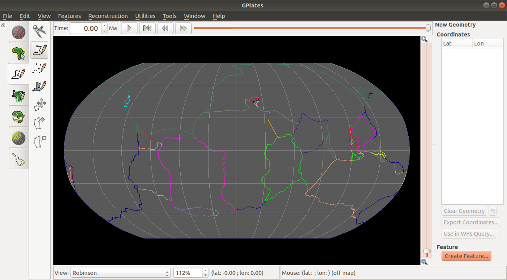
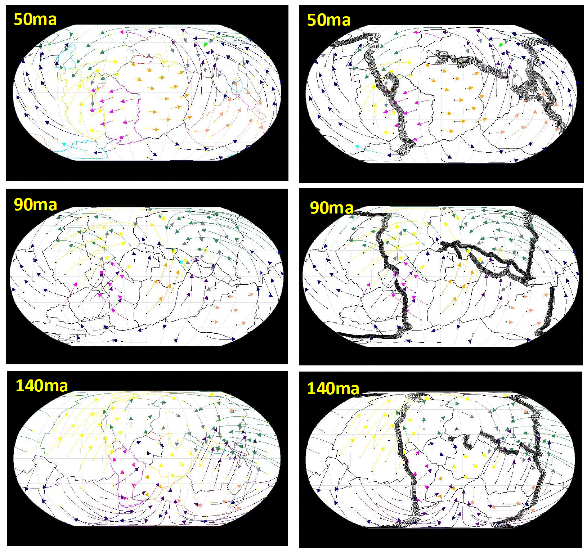

# Global Geoid Reconstruction using HC Code and GPlates

## Overview

This repository showcases a deep-time computational geodynamics project focused on reconstructing global subduction zones and modelling the evolution of geoid anomalies through time.

The project combines plate tectonic reconstruction, subducted slab reconstruction, and mantle circulation modelling using the HC convection code. The workflow was developed to investigate how upper mantle subducted slabs contribute to the long-wavelength geoid signal from the past to the present day.

This repository is intended as a professional portfolio project demonstrating skills in computational geoscience, deep-time tectonic modelling, mantle dynamics, scientific programming, and geophysical visualization.

## Example Visualizations

### 1. GPlates-Based Global Subduction Reconstruction



This figure shows the workflow used to reconstruct global subduction zone geometries from 140 Ma to present day using GPlates and the plate reconstruction model of Matthews et al. (2016).

GPlates was used to:
- Visualize deep-time plate tectonic evolution
- Identify and extract global subduction zone locations
- Reconstruct subducted slab geometries through time
- Generate spatial inputs for mantle circulation and geoid modelling workflows

### 2. Deep-Time Slab Reconstruction Through Geological Time



Global subduction zone geometries were reconstructed through geological time using deep-time plate tectonic reconstruction workflows.

The figure illustrates reconstructed slab configurations and associated plate kinematic evolution at:
- 50 Ma
- 90 Ma
- 140 Ma

The left panels show reconstructed plate motions and subduction geometries, while the right panels illustrate slab-derived mantle structures used for subsequent mantle circulation and geoid modelling.

These reconstructions formed the basis for:
- Slab density heterogeneity generation
- Mantle circulation calculations
- HC geoid modelling inputs
- Deep-time mantle structure interpretation

## Scientific Motivation

Density heterogeneity within the mantle contributes to geoid undulations observed at Earth’s surface. Subducted slabs represent one of the strongest sources of mantle density anomalies. However, the time evolution of the geoid signal arising from reconstructed subducted slabs remains challenging to constrain.

This project addresses that problem by reconstructing subduction zones through geological time and using mantle circulation modelling to predict geoid anomalies.

## Project Objectives

- Reconstruct global subduction zone geometries through deep time
- Convert reconstructed slab geometries into mantle density heterogeneity models
- Use HC mantle circulation modelling to compute geoid anomalies
- Compare time-evolved predicted geoid patterns with present-day slab-based geoid models
- Test the influence of different radial mantle viscosity structures on the predicted geoid

## Tools and Technical Workflow

### Plate Reconstruction

- GPlates
- pyGPlates / PlateTectonicTools
- Deep-time plate reconstruction models
- Subduction zone coordinate extraction
- Reconstruction of slab locations through geological time

### Mantle Circulation and Geoid Modelling

- HC mantle circulation code
- Hager and O’Connell style global mantle flow modelling
- Spherical harmonic density input preparation
- Radial viscosity model testing
- Free-slip surface and core-mantle boundary conditions

### Post-processing and Visualization

- GMT for global map generation and geoid visualization
- Python for data processing, plotting, and workflow automation
- MATLAB for numerical analysis and graphing
- Adobe Illustrator and Inkscape for publication-quality figure design

## General Workflow

```text
Deep-time plate reconstruction
        ↓
Global subduction zone extraction
        ↓
Slab geometry reconstruction through time
        ↓
Conversion to gridded density heterogeneity models
        ↓
Spherical harmonic density model preparation
        ↓
HC mantle circulation and geoid modelling
        ↓
GMT / Python / MATLAB post-processing
        ↓
Scientific interpretation and visualization
