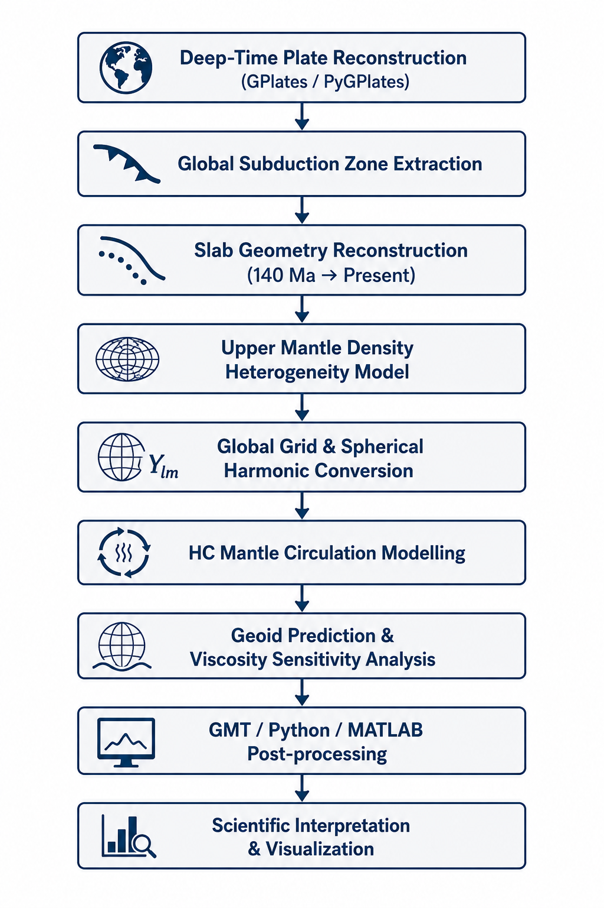
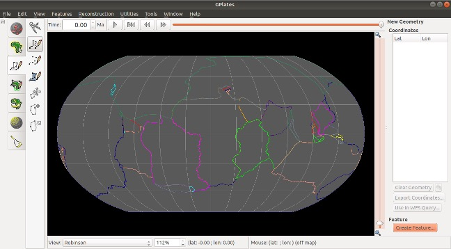
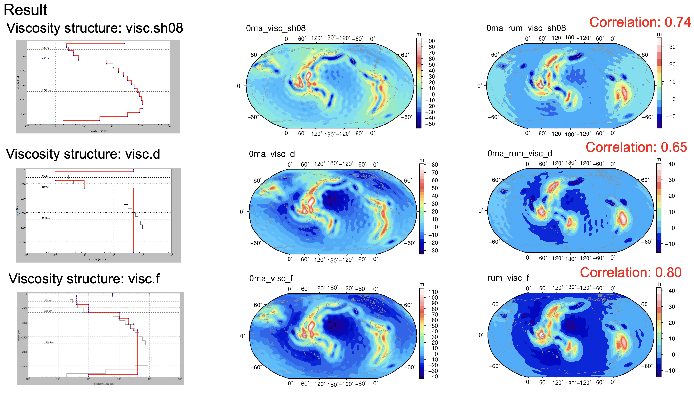

# Global Geoid Reconstruction using HC Code and GPlates

## Overview

This repository showcases a deep-time computational geodynamics project focused on reconstructing global subduction zones and modelling the evolution of geoid anomalies through geological time.

The project integrates:
- GPlates / PyGPlates plate reconstruction workflows
- Deep-time slab reconstruction
- Upper mantle density heterogeneity modelling
- HC mantle circulation simulations
- Geoid prediction and viscosity sensitivity analysis
- GMT / Python / MATLAB post-processing workflows

The repository is designed as a professional computational geoscience portfolio project demonstrating workflow development, tectonic reconstruction, mantle dynamics modelling, and scientific visualization.

---

# Computational Workflow Overview



Integrated workflow used for:
- Deep-time tectonic reconstruction
- Slab geometry reconstruction
- Mantle density heterogeneity modelling
- HC mantle circulation modelling
- Geoid prediction and sensitivity analysis
- GMT/Python/MATLAB-based scientific analysis and visualization

---

# Example Visualizations

## 1. GPlates-Based Global Subduction Reconstruction



This figure shows the workflow used to reconstruct global subduction zone geometries from 140 Ma to present day using GPlates and the plate reconstruction model of Matthews et al. (2016).

GPlates was used to:
- Visualize deep-time plate tectonic evolution
- Identify and extract global subduction zone locations
- Reconstruct subducted slab geometries through time
- Generate spatial inputs for mantle circulation and geoid modelling workflows

---

## 2. Deep-Time Slab Reconstruction Through Geological Time


Global subduction zone geometries were reconstructed through geological time using deep-time plate tectonic reconstruction workflows.

The figure illustrates reconstructed slab configurations and associated plate kinematic evolution at:
- 50 Ma
- 90 Ma
- 140 Ma

The left panels show reconstructed plate motions and subduction geometries, while the right panels illustrate slab-derived mantle structures used for subsequent mantle circulation and geoid modelling.

These reconstructions formed the basis for:
- Slab density heterogeneity generation
- Mantle circulation calculations
- HC geoid modelling inputs
- Deep-time mantle structure interpretation

---

## 3. Mantle Viscosity Sensitivity and Geoid Prediction



Different radial mantle viscosity structures were tested using the HC mantle circulation model to investigate their influence on predicted global geoid anomalies through geological time.

The figure compares predicted geoid structures generated using multiple viscosity configurations, including:
- visc.sh08
- visc.d
- visc.f

at different geological stages, including:
- 140 Ma
- 100 Ma
- 60 Ma
- 20 Ma
- Present day

Correlation analyses between viscosity models demonstrate that:
- Large-scale geoid structure remains broadly consistent across different viscosity configurations
- Mantle rheology strongly influences anomaly amplitude and spatial distribution
- Slab-derived mantle density heterogeneity plays a dominant role in long-wavelength geoid evolution

These experiments were used to evaluate the sensitivity of slab-driven mantle circulation and geoid prediction to radial mantle viscosity structure.

---

# Scientific Motivation

Density heterogeneity within the mantle contributes to geoid undulations observed at Earth’s surface. Subducted slabs represent one of the strongest sources of mantle density anomalies. However, the time evolution of the geoid signal arising from reconstructed subducted slabs remains challenging to constrain.

This project addresses that problem by reconstructing subduction zones through geological time and using mantle circulation modelling to predict geoid anomalies.

---

# Project Objectives

- Reconstruct global subduction zone geometries through geological time
- Convert reconstructed slab geometries into mantle density heterogeneity models
- Use HC mantle circulation modelling to compute geoid anomalies
- Compare predicted geoid patterns with present-day slab-based geoid models
- Test the influence of radial mantle viscosity structure on geoid prediction

---

# Tools and Technical Workflow

## Plate Reconstruction
- GPlates
- PyGPlates
- Deep-time plate reconstruction models
- Subduction zone coordinate extraction
- Slab geometry reconstruction

## Mantle Circulation and Geoid Modelling
- HC mantle circulation code
- Hager & O’Connell mantle flow modelling framework
- Spherical harmonic density model preparation
- Radial viscosity sensitivity testing
- Free-slip boundary condition modelling

## Post-processing and Visualization
- GMT for global map generation and geoid visualization
- Python for data processing and workflow automation
- MATLAB for numerical analysis and plotting
- Adobe Illustrator and Inkscape for publication-quality figure preparation

---

# Repository Structure

```text
docs/
    Supplementary technical documentation and extended results

figures/
    Workflow diagrams, reconstruction figures, and geoid results

scripts/
    Computational workflow scripts for reconstruction, density modelling,
    geoid analysis, and visualization

data/
    Metadata and sample input files

outputs/
    Representative processed outputs and figures
```

---

# Computational Workflow Scripts

Representative workflow scripts are available in the `scripts/` directory, including:
- Deep-time subduction reconstruction using PyGPlates
- Slab geometry reconstruction
- Global slab grid generation
- HC mantle circulation preprocessing
- Geoid sensitivity analysis
- GMT-based visualization workflows

The workflow integrates Python, GMT, MATLAB, and geodynamic modelling tools into a reproducible computational geoscience pipeline.

---

# Skills Demonstrated

- Deep-time tectonic reconstruction
- Computational geodynamics
- Mantle circulation modelling
- Geoid anomaly prediction
- Scientific programming and workflow automation
- GMT/Python/MATLAB post-processing
- Scientific visualization and figure preparation
- Geophysical interpretation and modelling

---

# Notes

This repository contains selected materials intended to demonstrate computational workflows, modelling methodology, and scientific visualization capability.

Full unpublished datasets, production outputs, and manuscript-sensitive files are not included.

---

# Author

**Amar Jyoti Baruah**  
PhD Researcher – Computational Geodynamics  
University of Alberta
