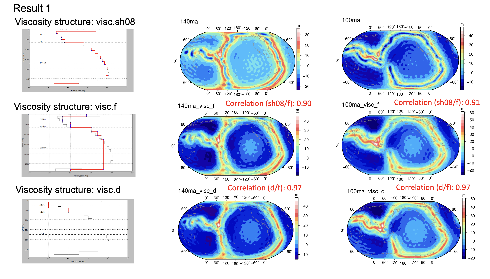
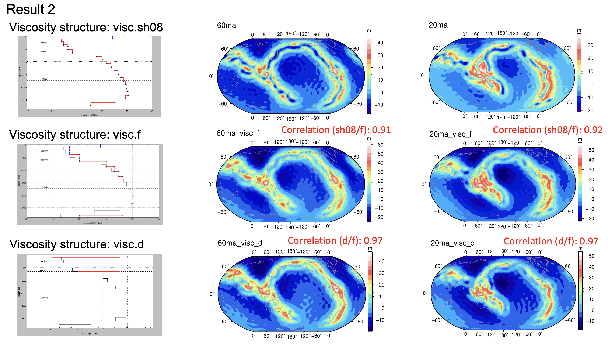

# Project Summary

## Project Title

Global Geoid Reconstruction from Deep-Time Slab Models using GPlates and HC Mantle Circulation Code

## Purpose of the Project

This project investigates how reconstructed subduction zones through geological time can be used to model mantle density heterogeneity and predict global geoid anomalies.

The goal was to connect deep-time plate tectonic reconstruction with mantle circulation modelling in order to understand how subducted slabs contribute to long-wavelength geoid structure from the Mesozoic to the present day.

## Scientific Background

Subducted slabs are major sources of positive density anomalies in the mantle. These density anomalies influence mantle flow and contribute to surface geoid variations.

To study this process, global subduction zone locations were reconstructed through time and converted into slab-derived mantle density structures. These density models were then used as inputs for HC mantle circulation modelling.

## Workflow Summary

```text
GPlates plate reconstruction
        ↓
Subduction zone identification
        ↓
Slab geometry reconstruction through time
        ↓
Density heterogeneity model generation
        ↓
Spherical harmonic model preparation
        ↓
HC mantle circulation modelling
        ↓
Predicted geoid anomaly calculation
        ↓
GMT / MATLAB / Python visualization and analysis
```

## Supplementary Geoid Modelling Results

The main repository README highlights the present-day geoid prediction panel as the primary showcase result. Additional time-dependent viscosity sensitivity results are documented here to show how predicted geoid patterns evolve through geological time.

### Viscosity Sensitivity at 140 Ma and 100 Ma



This panel shows predicted geoid anomalies generated using different radial mantle viscosity structures at 140 Ma and 100 Ma.

These results demonstrate:
- How slab-derived mantle density heterogeneity influences long-wavelength geoid structure during early reconstruction stages
- How different viscosity models affect predicted geoid amplitude and spatial distribution
- The importance of testing mantle rheology when interpreting geoid predictions from reconstructed slabs

### Viscosity Sensitivity at 60 Ma and 20 Ma



This panel shows predicted geoid anomalies generated using different radial mantle viscosity structures at 60 Ma and 20 Ma.

These results demonstrate:
- The persistence of large-scale geoid patterns through later reconstruction stages
- Time-dependent changes in predicted geoid structure as slab distributions evolve
- The sensitivity of regional geoid anomalies to mantle viscosity structure

Together, these supplementary panels support the main present-day result by showing that the modelling workflow can track geoid evolution across multiple geological time steps.
